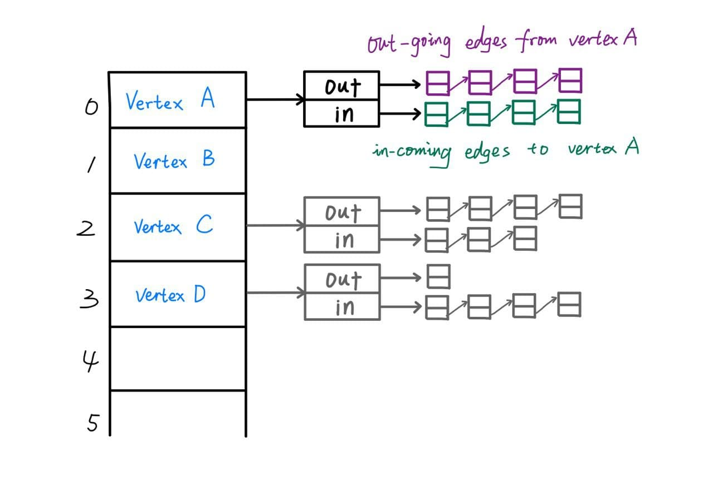
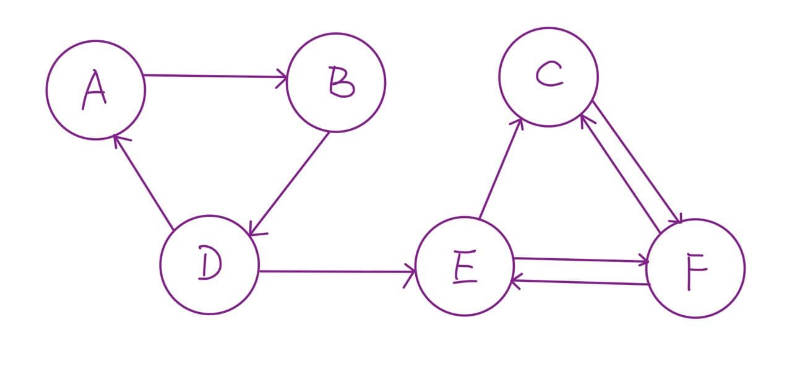
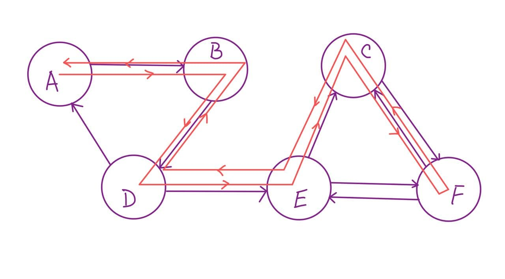
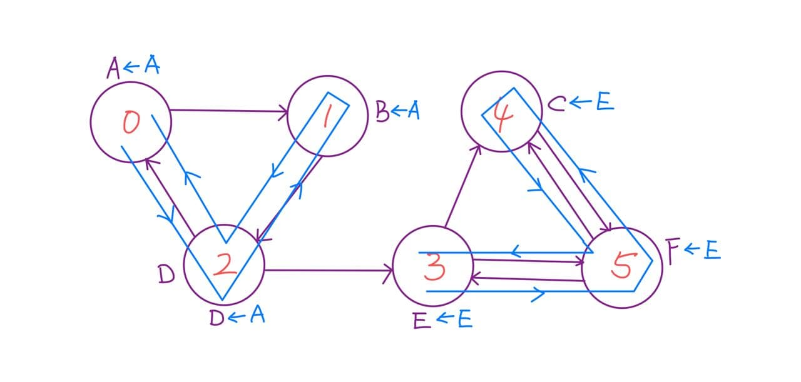
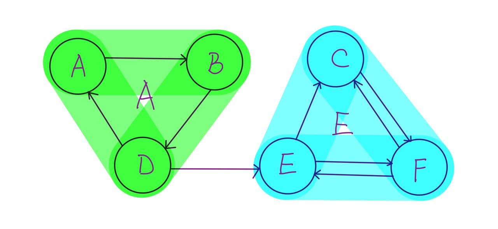

# 50.004 2D Submission / Group No. 30

- **Daniel Low Yu Hian** (1004372)

- **Sim Jia Ren** (1004401)

- **Sean Gunawan** (1004414)

- **Chan Jun Hern, Cawin** (1004487)

- **Huang He** (1004561)

---

### Implementation Details 

The algorithm that solves the 2-SAT in linear time mainly consist of the following 5 steps, which will be explained in details in the following sections.

1. Parse a 2-SAT file in Conjunctive Normal Form
2. Construct Implication Graph
3. Find Strongly Connected Components (Kosaraju's algorithm)
4. Check satisfiability 
5. Get a satisfiable solution

### 1 - Parse a 2-SAT file in Conjunctive Normal Form

**Representation of 2-SAT problem in Python: **

```python
Literal = int
Clause = Tuple[Literal]
Formula = List[Clause]
```

Literals:

- Integer `x` represents variable
- Positive Integer -> Positive Literal
- Negative Integer -> Negation of Literal

Clause:

- Since a Clause in 2-SAT problem always has a length of 2, we let an immutable Tuple containing 2 Integer to represent a Clause.

Formula:

- Formula is simply a list of Clauses.


**A sample of CNF file input:**

```
c sample cnf
c 2-sat 
p cnf 4 6
1 4 0 
1 -2 0 
-1 2 0 
2 3 0
4 2 0
2 1 0
-1 3 0
```

- Comment line starts with `c`  will be ignored during parsing.
- Problem description line starts with `p` will also be ignored.
- Any Integer excludes zero represents a Literal.
- `0` represents the termination of a Clause. 


Parsed CNF problem look like this:

```Python
>>> parse_cnf_to_list(CNF_FILE_PATH)
[(1, 4), (1, -2), (-1, 2), (2, 3), (4, 2), (2, 1), (-1, 3)]
```


**Time Complexity:**

Parsing of CNF file takes linear time: O(n)


### 2 - Construct Implication Graph

**Implementation of Directed Graph**

The outermost data structure we use to store a Directed Graph is a hash table. We can visualize the data structure as follow:



We implement the following methods for the Directed Graph:

- `add_edge(vertex_a, vertex_b)` 
  - adds vertex_a and vertex_b into the Directed Graph if they are not in the graph already
    - Cost: `O(n)` while n is the number of vertices already in the graph
  - adds a new edge (pointing from `vertex_a` to `vertex_b`) to the Directed Graph 
    - Cost: `O(n)` while n is the number of outgoing edges of `vertex_a`
  - especially, add a new incoming edge for `vertex_b` 
    - we do this for Kosaraju's algorithm to use later
    - Cost: `O(n)` while n is the number of outgoing edges of `vertex_b`
- `all_vertices()`
  - returns a list of vertices in the graph
  - Cost: `O(1)`
- `out_neighbors(vertex)`
  - returns the list of out-neighbors (vertices pointed by the out-going edges from the given vertex)
  - Cost: `O(1)`
- `in_neighbors(vertex)`
  - returns the list of in-neighbors (vertices that has an edge pointing to the given vertex)
  - Cost: `O(1)`

- `topological_sort()`
  - returns a list of vertices in the graph in topological order.
  - the implementation is based on Depth-First Search, each edge and vertex is visited once, the algorithm runs in linear time.
  - Cost: `O(n)` while n is the number of edges

**Construction of Implication Graph from a 2-SAT CNF Formula**

When we have a Clause like `(A, B)` which is representing `A or B`. The relationship between A and B implies that:

- In order for the Clause to be True, if the negation of A is True, B must be True.
- In order for the Clause to be True, if the negation of B is True, A must be True.

Hence, for each Clause in the Formula, we add two directed edges that represents these two implied logic. The implementation of this part is straightforward 

- We are using the `DirectedGraph` class we defined earlier for the Implication Graph. 
- The negation of Literal is simply done by flipping the sign of the Integer, because we are using Integer representing Literal. 

```python
def construct_implication_graph(formula) -> DirectedGraph:
    formula: List[Clause]
    implication_graph = DirectedGraph()     # Θ(1)
    for clause in formula:                  # Θ(number of clauses)
        A, B = clause                       # Θ(1)
        implication_graph.add_edge(-A, B)   # Ω(1), O(VE)
        implication_graph.add_edge(-B, A)   # Ω(1), O(VE)
    return implication_graph
```

### 3 - Find Strongly Connected Components 	

To find the Strongly Connected Components inside the Implication Graph, we choose to implement the [Kosaraju's algorithm](https://en.wikipedia.org/wiki/Kosaraju%27s_algorithm) which does Depth-First Search twice. We use a simplified sample Directed Graph to illustrate the algorithm.

Let's say we have a Directed Graph containing 6 vertices namely from A to F as shown below:




**First DFS**

we do a depth-first recursive visit and record down the sequence of last exit time for each vertex.

```python
visited = []
L: List = []

def visit(graph: DirectedGraph, vertex, visited, L):
    if vertex not in visited:
        visited.append(vertex)
        for i in graph.out_neighbors(vertex):
            visit(graph, i, visited, L)
        L.insert(0, vertex)
        
for vertex in graph.all_vertices():
	visit(graph, vertex, visited, L)
```

The red path below show the order of the visit: 



During the first DFS, the running list L would grow like this:

```
L: [F]
L: [C, F]
L: [E, C, F]
L: [D, E, C, F]
L: [B, D, E, C, F]
L: [A, B, D, E, C, F]
```

**Second DFS**

This time, we traverse through the list L, and do a depth-first visit and a strongly-connected-component assignment for each unvisited vertex.

- each Strongly Connected Component is simply represented by a root vertex from that component.
- we are using the `in_neighbors(vertex)` function we defined earlier to visit each vertex in the graph reversely.

```python
def assign(graph: DirectedGraph, scc_assignment: dict, vertex, root):
        if vertex not in scc_assignment:
            # assign vertex to the root of a strongly_connected_component
            scc_assignment[vertex] = root

            for in_neighbor in graph.in_neighbors(vertex):
                assign(graph, scc_assignment, in_neighbor, root)

scc_assignment: Dict[Vertex, Vertex] = {}
for vertex in L:
    assign(graph, scc_assignment, vertex, vertex)
```

The blue path below show the order of the visit: 

- It starts from vertex A because it has index 0 in the list L.
- It goes to vertex D because it is an in-neighbor of vertex A.
- It goes to vertex B because it is an in-neighbor of vertex D.
- It backtracks to vertex D because vertex B has no more unvisited in-neighbor.
- It backtracks to vertex A because vertex D has no more unvisited in-neighbor.
- It continues from vertex E because it has index 3 in the list L and the lower indexed vertices have been visited. 
- so on and so forth...



During this second DFS, each vertex get assigned to a Strongly Connected Component, the root vertex changes only when the traversal jumps back to the list L. We end up with two Strongly Connected Components for this example, and their root vertices are `A` and `E`. 

**Complexity Analysis:**

- For the Strongly-Connected-Component assignment, we used a hash table so that each assignment and checking whether a vertex has been assigned to a group is done in instant time. 
- Overall, we basically done linear-time DFS twice, so we visit each vertices and edges in the graph twice. 

### 4 - Check Satisfiability 

At this point, we have got the Strongly Connected Components, and within each component, every vertex can reach any vertex inside the component. Since the Directed Graph is a Implication Graph that we build earlier to represent the implied relationship between literals if they were to make the clauses True. All the vertices or Literals within a same Strongly Connected Component must share the same truth assignment, whether it is True or False. Hence, we can use this property to find contradiction where a Literal and it negation belongs to the same Strongly Connected Component. If the contradiction is found, the Formula is simply not satisfiable. 

```python
for vertex in scc_assignment.keys():
        root = scc_assignment[vertex]
        if root in scc:
            scc[root].append(vertex)
        else:
            scc[root] = [vertex]

        if -vertex in scc[root]:
            print("UNSATISFIABLE")
            return    # the program halts if it not satisfiable
```

This operation costs `O(n)` time where `n` is the number of vertices or Literals. 

### 5 - Get a Satisfiable Solution

At this point, we can confirm that that there is a satisfiable solution, we just need to find one.

**Construct a condensation graph ($G^{SCC}$) based on Strongly Connected Components ($SCC$)**

To simplify the original Implication Graph into a condensation graph which just left with the root of each Strongly Connected Components and the connections between components. 

```python
condensed_graph = DirectedGraph()
    for vertex in scc_assignment.keys():
        self_root = scc_assignment[vertex]
        for out_neighbor in graph.out_neighbors(vertex):
            out_root = scc_assignment[out_neighbor]
            if self_root == out_root:
                continue
            condensed_graph.add_edge(self_root, out_root)
```

This operation costs `O(n)` time where `n` is the number of vertices or Literals. 

If we continue with the example, we have two Strongly Connected Components highlighted below:



The resulting condensation graph ($G^{SCC}$) should and must be a Directed Acyclic Graph (DAG) because there is no both-way connection between two Strongly Connected Components.


**Topological Ordering on the condensation graph ($G^{SCC}$)**

We simply call the `topological_sort` method we defined for this condensation graph ($G^{SCC}$), we get a list of topologically ordered vertices that are the root vertex for each Strongly Connected Components, and we reverse it. 

This `topological_sort` method is essentially a DFS which takes `O(n)` time where `n` is the number of Strongly Connected Components. 

```python
reversed_topological_order: List = condensed_graph.topological_sort()[::-1]
```

**Create Truth Assignments for Literals**

As discussed above, we just need to force assign all the Literals within a same Strongly Connected Component to True, and all the negation of the Literals to False, in a reversed topological order.

```python
truth_assignment = {}
for root in reversed_topological_order:
    if root not in truth_assignment:
        for literal in scc[root]:
            truth_assignment[literal] = 1
            truth_assignment[-literal] = 0

solution = [
    truth_assignment[i] for i in sorted(list(truth_assignment.keys())) if i > 0
]
```

This operation costs `O(n)` time where `n` is the number of Literals. 

### Summary

- Parser: O(n)

- Solver: O(n)
  - Construct Implication Graph: O(n)
  - DFS - Find Strongly Connected Components: O(n)
  - Check satisfiability: O(n)
    - Not satisfiable -> Return
    - Satisfiable -> Get a satisfiable solution
  - Get a satisfiable solution: O(n)
    - Construct a condensation graph: O(n)
    - DFS - Topological Ordering: O(n)
    - Create Truth Assignments -> Return assignments: O(n)


### Bonus: Random 2-SAT Solver

The implementation of Random Solver is quite straightforward:

1. Parse CNF file into a list of Clauses
2. Initialize arbitrary truth assignment for all variables. (we chose to assign all variable to False first.)
3. While number of steps less than $100 n^2$:
   - Check if the assignment satisfiable
     - If satisfiable -> return truth assignment 
     - If not satisfiable -> Flip assignment for one of the literals in the false Clause.

Implementation details refers to code below:

```python
def check_assignment(formula: List[Tuple], truth_assignment: Dict):
    for clause in formula:
        a, b = clause
        if not (truth_assignment[a] or truth_assignment[b]):
            return random.choice(clause)
    return

def flip_assignment(truth_assignment: Dict, literal):
    if truth_assignment[literal] == 0:
        truth_assignment[literal] = 1
        truth_assignment[-literal] = 0
    else:
        truth_assignment[literal] = 0
        truth_assignment[-literal] = 1

def randomize_solve(cnf: str):
    number_of_variable = 0
    truth_assignment = {}
    formula: List[Tuple] = parse_cnf_to_list(cnf)

    # initialise truth assignment by setting all variable to false
    for clause in formula:
        for literal in clause:
            if literal not in truth_assignment and -literal not in truth_assignment:
                number_of_variable += 1
            if literal not in truth_assignment:
                if literal > 0:
                    truth_assignment[literal] = 0
                    truth_assignment[-literal] = 1
                else:
                    truth_assignment[literal] = 1
                    truth_assignment[-literal] = 0
    
    max_steps = 100 * number_of_variable ** 2

    while max_steps >= 0:
        max_steps -= 1
        picked_literal = check_assignment(formula, truth_assignment)
        if picked_literal == None:
            break
        else:
            flip_assignment(truth_assignment, picked_literal)

    solution = [
        truth_assignment[i] for i in sorted(list(truth_assignment.keys())) if i > 0
    ]
    return solution
```

### Runtime Comparison 

I have created two 2-SAT CNF file for runtime comparison between these two implementation:

Sample CNF 1: 

- Number of Variables: 1000
- Number of Clauses: 1001
- Expected Result: **Satisfiable**

Sample CNF 2: 

- Number of Variables: 1000
- Number of Clauses: 1002
- Expected Result: **Not Satisfiable**

Machine used for experiment: Intel Cpre i7-9700K (Desktop Ubuntu 18.04)

Experimental Runtime Result shown as follow:


